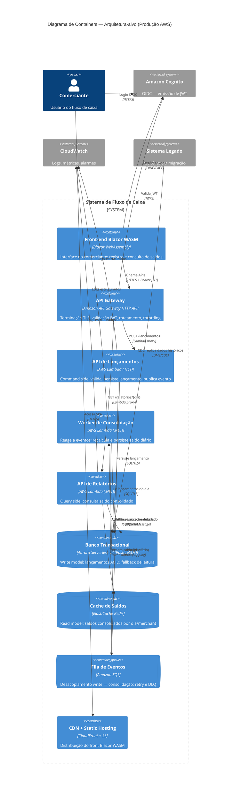
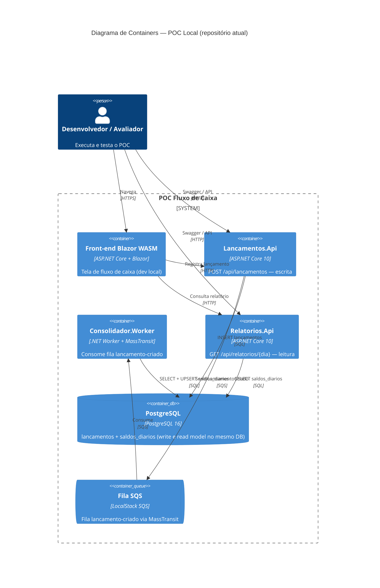

# C4 Model — Nível 2: Diagrama de Containers

> **Propósito:** mostrar a decomposição em **containers** (aplicações/serviços deployáveis), suas responsabilidades, tecnologias e protocolos de comunicação — padrão esperado para revisão de arquitetura sênior.

## Princípios de decomposição

| Princípio | Como se manifesta |
|-----------|-------------------|
| **CQRS** | Escrita (`Lançamentos`) separada da leitura (`Relatórios`) |
| **Event-driven** | Consolidação reage a `LancamentoCriado` sem bloquear o POST |
| **Resiliência** | Falha na consolidação não impede registro do lançamento |
| **Strangler Fig** | Front legado redireciona funcionalidades migradas para o novo stack |

## Diagrama de Containers — Produção (alvo AWS)



## Diagrama de Containers — POC local (implementado)



## Matriz de containers

| Container | Responsabilidade | Tecnologia (produção) | Tecnologia (POC) | Protocolos |
|-----------|------------------|----------------------|-------------------|------------|
| Front-end | UX do comerciante | Blazor WASM + CloudFront/S3 | Blazor WASM (Kestrel dev) | HTTPS, OIDC (prod) |
| API Gateway | Segurança na borda, roteamento | API Gateway HTTP API | *Ausente* — APIs expostas diretamente | HTTPS, JWT |
| API Lançamentos | Validar e persistir; publicar evento | Lambda .NET | `Lancamentos.Api` | REST/JSON |
| Worker Consolidação | Recalcular saldo do dia | Lambda .NET (SQS trigger) | `Consolidador.Worker` | Mensageria |
| API Relatórios | Consultar saldo consolidado | Lambda .NET | `Relatorios.Api` | REST/JSON |
| Banco transacional | Fonte da verdade dos lançamentos | Aurora Serverless v2 | PostgreSQL 16 | SQL |
| Cache / read model | Leitura rápida de saldos | Redis | Tabela `saldos_diarios` no PostgreSQL | Redis / SQL |
| Fila | Desacoplamento assíncrono | SQS + DLQ | LocalStack SQS | SQS |

## Fluxos principais entre containers

### 1. Registro de lançamento (write path)

```
Comerciante → Front → API Gateway → API Lançamentos → Aurora
                                              ↓
                                            SQS → Worker → Redis (+ Aurora read)
```

**Garantia:** o lançamento é persistido antes da publicação do evento (ordem no handler). A consolidação é **eventualmente consistente**.

### 2. Consulta de saldo (read path)

```
Comerciante → Front → API Gateway → API Relatórios → Redis
                                              ↓ (miss)
                                            Aurora (saldos_diarios)
```

### 3. Migração (Strangler)

```
Legado → CDC → Aurora (dados históricos)
Legado Front → redirect → Novo Front (funcionalidades migradas)
```

## Gaps críticos: POC vs. produção

| Aspecto | Produção (diagrama superior) | POC (código atual) | Impacto |
|---------|------------------------------|--------------------|---------|
| Autenticação | Cognito + JWT no API Gateway | Nenhuma | Qualquer cliente pode chamar as APIs |
| Multi-tenant | `merchantId` em todas as entidades | Ausente no schema | Dados não isolados por comerciante |
| Read model | Redis com fallback Aurora | Tabela PostgreSQL | Funcional, mas sem latência < 50 ms prometida |
| DLQ / idempotência | SQS DLQ + deduplicação | Retry MassTransit (3×); sem DLQ; reprocessamento recalcula dia inteiro | Risco em mensagens duplicadas |
| Compute | Lambda serverless | Processos ASP.NET/Core long-running | POC não valida cold start, IAM por função |
| Observabilidade | CloudWatch + X-Ray | `Console.WriteLine` no worker | Sem métricas/alertas reais |

Esses gaps são tratados nos [ADRs](../adr/README.md) (decisão + estado de implementação) e nos [requisitos funcionais](../requirements/requisitos-funcionais.md).

## Referências

- [C4 Model — Contexto](c4-context.md)
- [ADR-002: CQRS e eventos](../adr/0002-cqrs-event-driven-consolidation.md)
- [ADR-004: Redis como read model](../adr/0004-redis-read-model.md)
- [RBAC](../security/rbac.md)
