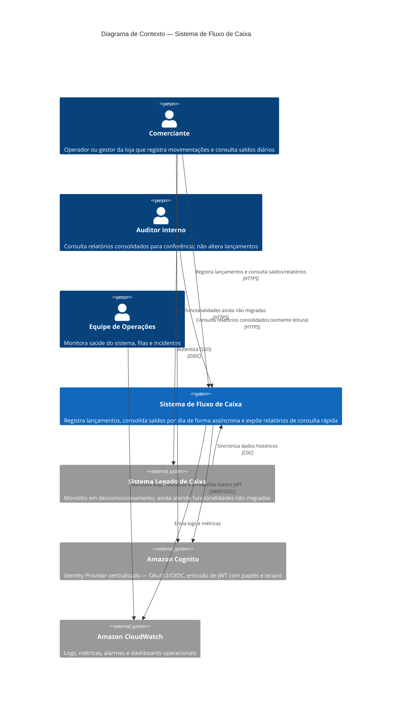

# C4 Model — Nível 1: Diagrama de Contexto

> **Propósito:** comunicar para stakeholders executivos e técnicos *o que* o sistema faz, *quem* interage e *com quais sistemas externos* se integra — sem entrar em detalhes de implementação (Lambda, filas, bancos).

## Escopo do sistema

O **Sistema de Fluxo de Caixa** permite que comerciantes registrem movimentações financeiras diárias (entradas e saídas), consultem o histórico e obtenham o **saldo consolidado por dia** para tomada de decisão operacional. Ele substitui gradualmente o sistema legado, mantendo continuidade de negócio durante a migração.

## Diagrama de Contexto (C1)

## Atores e motivações

| Ator | Objetivo de negócio | Interação principal |
|------|---------------------|---------------------|
| **Comerciante** | Controlar entradas/saídas do caixa da loja e saber o resultado do dia sem esperar processamento batch noturno | CRUD de lançamentos; consulta de saldo diário |
| **Auditor interno** | Conferir consistência entre movimentações e saldo consolidado | Somente leitura de relatórios |
| **Equipe de Operações** | Garantir SLA, detectar falhas na consolidação e na fila | Observabilidade (não é usuário de negócio do domínio) |

## Sistemas externos

| Sistema | Responsabilidade | Por que é externo ao boundary |
|---------|------------------|-------------------------------|
| **Sistema Legado** | Continuidade durante migração Strangler Fig | Fora do escopo de evolução; será desligado |
| **Amazon Cognito** | Autenticação unificada (legado + novo front) | Capacidade transversal de identidade; não é domínio de fluxo de caixa |
| **Amazon CloudWatch** | Observabilidade operacional | Plataforma de infraestrutura compartilhada |

## Capacidades de negócio (visão executiva)

1. **Registrar movimentação** — capturar crédito ou débito com data e descrição auditável.
2. **Consolidar o dia** — calcular saldo líquido (Σ créditos − Σ débitos) de forma desacoplada da escrita.
3. **Consultar resultado** — entregar saldo consolidado com latência baixa para o comerciante.
4. **Migrar sem interrupção** — coexistir com o legado até substituição completa.

## O que este diagrama *não* mostra (deliberadamente)

- Containers internos (APIs, workers, bancos) → ver [C4 Nível 2](c4-containers.md)
- Fluxos de sequência por endpoint → ver [README seção 13](../../README.md)
- Decisões tecnológicas e trade-offs → ver [ADRs](../adr/README.md)

## Escopo: arquitetura-alvo vs. POC

| Diagrama | Representa |
|----------|------------|
| Este documento (C1) | Sistema em produção — contexto de negócio |
| [C4 Nível 2 — Produção](c4-containers.md#diagrama-de-containers--produção-alvo-aws) | Arquitetura-alvo AWS |
| [C4 Nível 2 — POC](c4-containers.md#diagrama-de-containers--poc-local-implementado) | O que está implementado em `src/` |

Detalhes de gaps POC ↔ produção: [C4 Containers — matriz e gaps](c4-containers.md).
