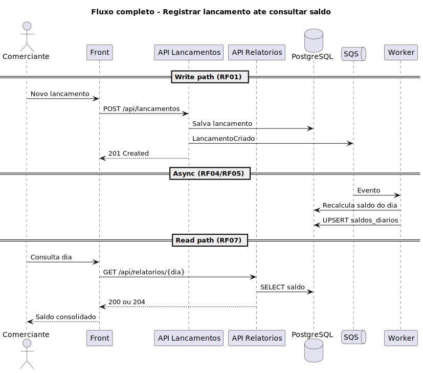
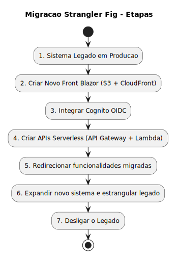

# Diagramas de Sequência — Features

> **Convenção:** estrutura → [C4 PlantUML](c4-context.md) · comportamento por feature → **sequência PlantUML** (este documento).

---

## Índice por feature

| Feature | RF | SVG | Fonte |
|---------|-----|-----|-------|
| Registrar lançamento + publicar evento | RF01, RF03 | `seq-rf01-registrar-lancamento.svg` | [`seq-rf01-registrar-lancamento.puml`](../images/plantuml/seq-rf01-registrar-lancamento.puml) |
| Processar evento e consolidar saldo | RF04, RF05 | `seq-rf04-rf05-consolidar-dia.svg` | [`seq-rf04-rf05-consolidar-dia.puml`](../images/plantuml/seq-rf04-rf05-consolidar-dia.puml) |
| Consultar saldo diário | RF07 | `seq-rf07-consultar-saldo.svg` | [`seq-rf07-consultar-saldo.puml`](../images/plantuml/seq-rf07-consultar-saldo.puml) |
| Consultar lançamentos | RF02 | `seq-rf02-consultar-lancamentos.svg` | [`seq-rf02-consultar-lancamentos.puml`](../images/plantuml/seq-rf02-consultar-lancamentos.puml) |
| Autenticação e RBAC | RF09, RF10 | `seq-rf09-rf10-autenticacao.svg` | [`seq-rf09-rf10-autenticacao.puml`](../images/plantuml/seq-rf09-rf10-autenticacao.puml) |
| Enforcement RBAC em camadas | RF10 | `seq-rbac-enforcement.svg` | [`seq-rbac-enforcement.puml`](../images/plantuml/seq-rbac-enforcement.puml) |
| Fluxo completo (write → async → read) | RF01–RF07 | `seq-fluxo-completo.svg` | [`seq-fluxo-completo.puml`](../images/plantuml/seq-fluxo-completo.puml) |
| Etapas da migração Strangler | ADR-0001 | `seq-migracao-etapas.svg` | [`seq-migracao-etapas.puml`](../images/plantuml/seq-migracao-etapas.puml) |

---

## RF01 + RF03 — Registrar lançamento

**Fonte PlantUML:** [`seq-rf01-registrar-lancamento.puml`](../images/plantuml/seq-rf01-registrar-lancamento.puml)

---

## RF04 + RF05 — Consolidar dia

**Fonte PlantUML:** [`seq-rf04-rf05-consolidar-dia.puml`](../images/plantuml/seq-rf04-rf05-consolidar-dia.puml)

---

## RF07 — Consultar saldo

**Fonte PlantUML:** [`seq-rf07-consultar-saldo.puml`](../images/plantuml/seq-rf07-consultar-saldo.puml)

---

## RF02 — Consultar lançamentos

**Fonte PlantUML:** [`seq-rf02-consultar-lancamentos.puml`](../images/plantuml/seq-rf02-consultar-lancamentos.puml)

---

## RF09 + RF10 — Autenticação

**Fonte PlantUML:** [`seq-rf09-rf10-autenticacao.puml`](../images/plantuml/seq-rf09-rf10-autenticacao.puml)

---

## RF10 — Enforcement RBAC

**Fonte PlantUML:** [`seq-rbac-enforcement.puml`](../images/plantuml/seq-rbac-enforcement.puml) · [RBAC](../security/rbac.md)

---

## Fluxo completo

**Fonte PlantUML:** [`seq-fluxo-completo.puml`](../images/plantuml/seq-fluxo-completo.puml)

---

## Migração — etapas Strangler

**Fonte PlantUML:** [`seq-migracao-etapas.puml`](../images/plantuml/seq-migracao-etapas.puml) · [ADR-0001](../adr/0001-strangler-fig-migration.md)

---

## Regenerar imagens

Ver [`docs/images/README.md`](../images/README.md).
