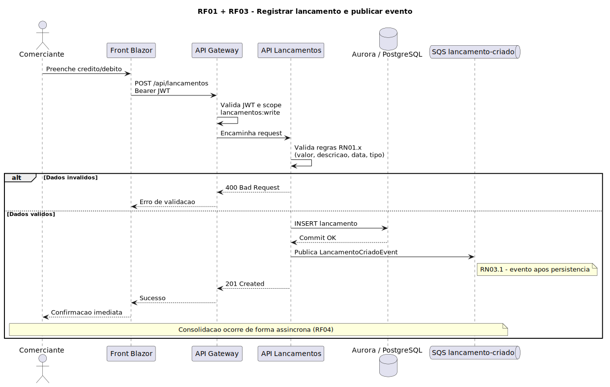
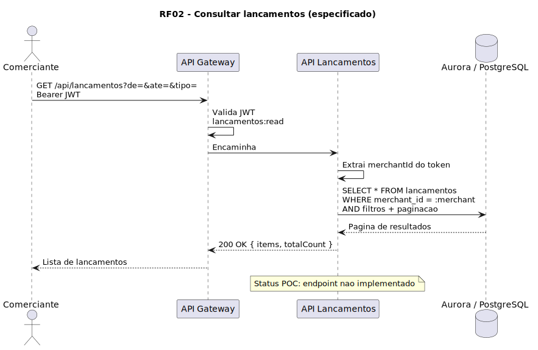
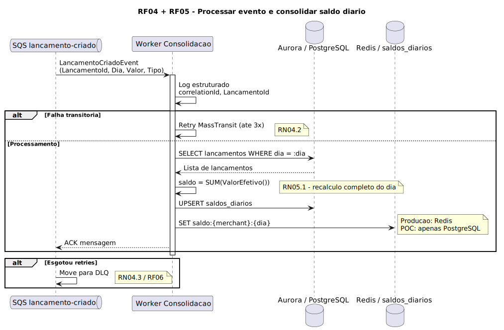
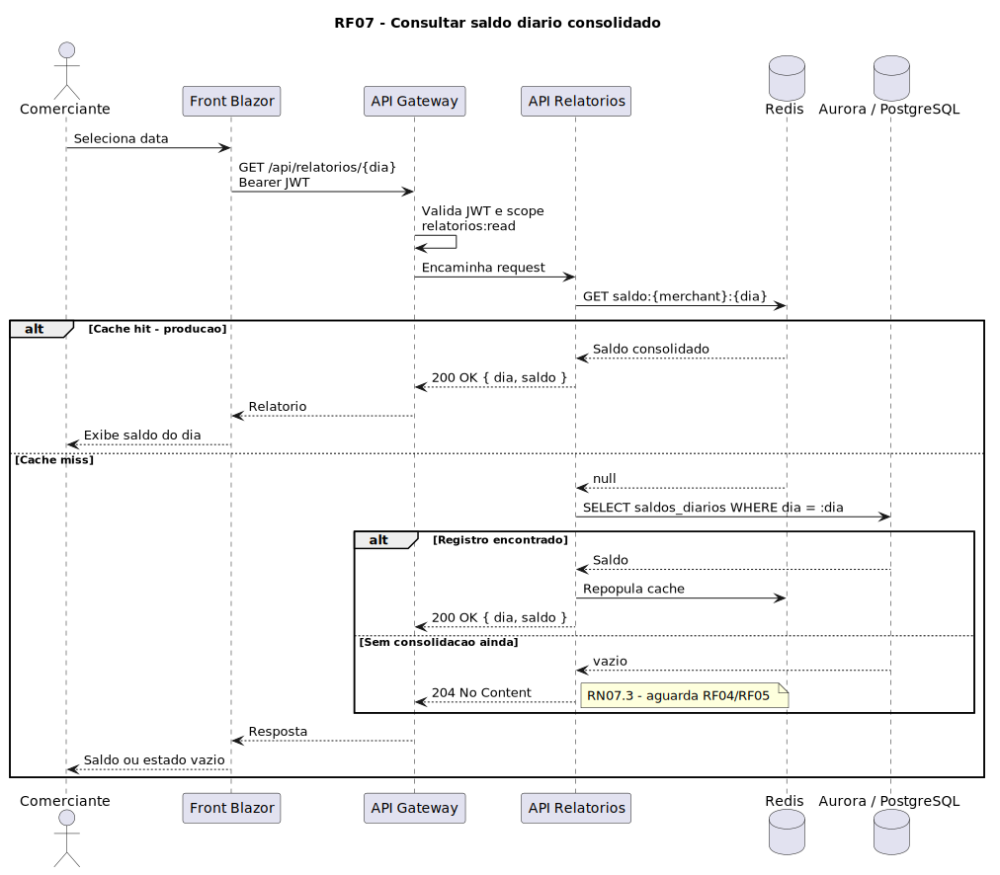
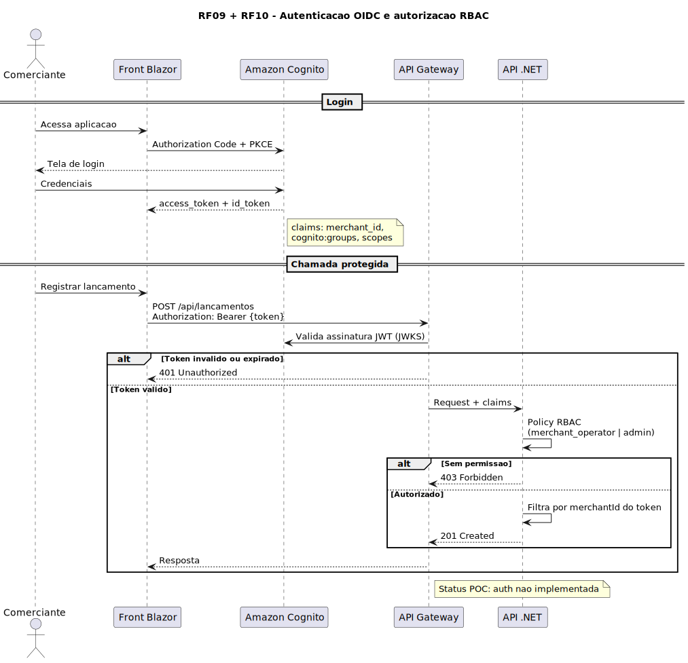
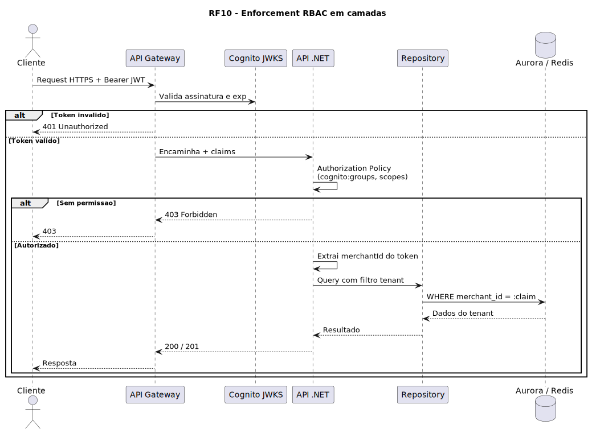

# Requisitos Funcionais

Especificação expandida dos requisitos funcionais do Sistema de Fluxo de Caixa. Cada RF inclui **objetivo de negócio (porquê)**, **regras de negócio**, **critérios de aceite** e **status no POC**.

> Resumo no [README §8](../../README.md#8-requisitos-funcionais-rf). Regras de negócio do desafio: *controle de lançamentos (débito/crédito)* e *relatório com saldo diário consolidado*.

> **Legenda Status POC:** ✅ Implementado | ⚠️ Parcial | ❌ Não implementado | 📋 Apenas especificado

> **Diagramas de feature:** cada RF relevante possui [diagrama de sequência](../architecture/sequences.md) (PlantUML). Visão estrutural: [C4](../architecture/c4-context.md).

---

## RF01 — Registrar lançamento financeiro

| Campo | Descrição |
|-------|-----------|
| **Ator** | Comerciante (`merchant_operator`, `merchant_admin`) |
| **Objetivo de negócio** | Permitir que o lojista registre entradas e saídas de caixa em tempo real, substituindo planilhas ou módulo legado, com trilha auditável para conciliação |
| **Descrição** | O sistema recebe um lançamento (crédito ou débito) associado a uma data civil e persiste como fonte da verdade |

### Regras de negócio

| ID | Regra | Implementação POC |
|----|-------|-------------------|
| RN01.1 | `valor` deve ser **estritamente positivo** (> 0) | ✅ `Lancamento` entity + `LancamentoValidator` |
| RN01.2 | `descricao` é **obrigatória** (não vazia após trim); máx. 200 caracteres | ✅ Entity + DB constraint `varchar(200)` |
| RN01.3 | `tipo` ∈ {`Credito`=1, `Debito`=2} | ✅ `TipoLancamento` enum |
| RN01.4 | `data` é obrigatória (formato `yyyy-MM-dd`) | ✅ `DateOnly` |
| RN01.5 | Crédito **aumenta** saldo; débito **diminui** (`ValorEfetivo()`) | ✅ Domain logic |
| RN01.6 | Lançamento recebe `Id` único (UUID) gerado pelo sistema | ✅ `Guid.NewGuid()` |
| RN01.7 | Lançamento deve pertencer ao `merchantId` do token JWT | ❌ Multi-tenant ausente |
| RN01.8 | Data não pode ser futura em relação ao fuso do merchant | ❌ Não validado |
| RN01.9 | Operador só registra para o próprio merchant (RBAC) | ❌ Ver [rbac.md](../security/rbac.md) |
| RN01.10 | Idempotência opcional via header `Idempotency-Key` (produção) | ❌ |

### Critérios de aceite

- [ ] POST com payload válido retorna `201 Created` com identificador
- [ ] POST com `valor <= 0` retorna `400` com mensagem clara
- [ ] POST sem descrição retorna `400`
- [ ] Lançamento persistido antes da publicação do evento
- [ ] Token sem permissão `lancamentos:write` retorna `403`

### API

`POST /api/lancamentos` — ver [README](../../README.md)

### Diagrama de sequência

**Fonte PlantUML:** [`seq-rf01-registrar-lancamento.puml`](../images/plantuml/seq-rf01-registrar-lancamento.puml) · [Índice](../architecture/sequences.md)

**Status POC:** ⚠️ Core implementado; auth, tenant e idempotência ausentes

---

## RF02 — Consultar lançamentos

| Campo | Descrição |
|-------|-----------|
| **Ator** | Comerciante, Auditor |
| **Objetivo de negócio** | Permitir auditoria e conferência das movimentações que compõem o saldo do dia |
| **Descrição** | Listagem paginada de lançamentos filtrada por merchant, período e tipo |

### Regras de negócio

| ID | Regra |
|----|-------|
| RN02.1 | Filtro obrigatório por `merchantId` do token |
| RN02.2 | Paginação default: 20 itens; máx. 100 |
| RN02.3 | Ordenação default: `data DESC`, `created_at DESC` |
| RN02.4 | Auditor: somente leitura (`lancamentos:read`) |
| RN02.5 | Não expor lançamentos de outro tenant (retornar lista vazia ou 404) |

### Critérios de aceite

- [ ] GET com filtros retorna apenas lançamentos do merchant autenticado
- [ ] Resposta paginada com `totalCount`

### Diagrama de sequência

**Fonte PlantUML:** [`seq-rf02-consultar-lancamentos.puml`](../images/plantuml/seq-rf02-consultar-lancamentos.puml)

**Status POC:** ❌ Endpoint não exposto (repositório `ObterPorDiaAsync` existe para uso interno da consolidação)

---

## RF03 — Publicar evento LancamentoCriado

| Campo | Descrição |
|-------|-----------|
| **Ator** | Sistema (após RF01) |
| **Objetivo de negócio** | Desacoplar a escrita da consolidação, permitindo que o comerciante receba confirmação rápida enquanto o saldo é calculado assincronamente |
| **Descrição** | Após persistir o lançamento, publicar mensagem na fila com payload mínimo para consolidação |

### Regras de negócio

| ID | Regra | POC |
|----|-------|-----|
| RN03.1 | Evento publicado **somente após** commit no banco | ✅ Ordem no handler |
| RN03.2 | Payload: `LancamentoId`, `Dia`, `Valor`, `Tipo` | ✅ `LancamentoCriadoEvent` |
| RN03.3 | Incluir `MerchantId` no evento (produção) | ❌ |
| RN03.4 | Falha na fila após persistência → lançamento órfão requer reconciliação/job | ❌ Sem outbox pattern |

### Critérios de aceite

- [ ] Mensagem visível na fila `lancamento-criado` após POST bem-sucedido
- [ ] Consumer processa em < 5 s (p95) em carga normal

> Sequência integrada ao RF01 — ver [seq-rf01-registrar-lancamento.puml](../images/plantuml/seq-rf01-registrar-lancamento.puml)

**Status POC:** ⚠️ Publicação funciona; sem outbox nem `MerchantId`

---

## RF04 — Processar eventos de lançamento

| Campo | Descrição |
|-------|-----------|
| **Ator** | Worker de Consolidação |
| **Objetivo de negócio** | Garantir que todo lançamento registrado reflita no saldo consolidado sem bloquear o usuário |
| **Descrição** | Consumer reage a `LancamentoCriado` e dispara consolidação do dia |

### Regras de negócio

| ID | Regra | POC |
|----|-------|-----|
| RN04.1 | Processamento idempotente (reprocessamento seguro) | ✅ Recálculo completo (ADR-0008) |
| RN04.2 | Retry em falha transitória (mín. 3 tentativas) | ✅ MassTransit retry |
| RN04.3 | Após esgotar retries → DLQ | ❌ |
| RN04.4 | Log estruturado com `LancamentoId`, `Dia`, `correlationId` | ⚠️ `Console.WriteLine` apenas |

### Diagrama de sequência

**Fonte PlantUML:** [`seq-rf04-rf05-consolidar-dia.puml`](../images/plantuml/seq-rf04-rf05-consolidar-dia.puml)

**Status POC:** ⚠️

---

## RF05 — Atualizar saldo diário consolidado

| Campo | Descrição |
|-------|-----------|
| **Ator** | Worker de Consolidação |
| **Objetivo de negócio** | Materializar o resultado financeiro do dia (quanto entrou, quanto saiu, saldo líquido) para consulta rápida |
| **Descrição** | Calcular e persistir saldo = Σ créditos − Σ débitos do dia (por merchant em produção) |

### Regras de negócio

| ID | Regra | POC |
|----|-------|-----|
| RN05.1 | Fórmula: `saldo = Σ ValorEfetivo()` dos lançamentos do dia | ✅ |
| RN05.2 | Upsert em `saldos_diarios` (PK `dia`; produção: `(merchant_id, dia)`) | ⚠️ PK só `dia` |
| RN05.3 | Atualizar Redis após persistir SQL (produção) | ❌ ADR-0004 |
| RN05.4 | Dia sem lançamentos → saldo 0 ou ausência de registro (definir: **ausência = 404 na consulta**) | ⚠️ Sem lançamentos = sem registro |

> Sequência: [seq-rf04-rf05-consolidar-dia.puml](../images/plantuml/seq-rf04-rf05-consolidar-dia.puml)

**Status POC:** ⚠️ Lógica correta para single-tenant

---

## RF06 — Registrar falhas em DLQ

| Campo | Descrição |
|-------|-----------|
| **Ator** | Sistema (infraestrutura SQS) |
| **Objetivo de negócio** | Evitar perda silenciosa de eventos e permitir reprocessamento manual após correção de bugs |
| **Descrição** | Mensagens que falham após N tentativas vão para Dead Letter Queue |

### Regras de negócio

| ID | Regra |
|----|-------|
| RN06.1 | `maxReceiveCount` = 5 antes de DLQ |
| RN06.2 | Alarme CloudWatch quando `DLQ depth > 0` |
| RN06.3 | Runbook: reprocessar após fix ou descartar com justificativa auditada |

**Status POC:** ❌ Listado como "próximo passo" no README — inconsistência corrigida aqui

---

## RF07 — Consultar saldo diário

| Campo | Descrição |
|-------|-----------|
| **Ator** | Comerciante, Auditor |
| **Objetivo de negócio** | Responder "quanto fechei hoje?" em tempo real para decisão operacional (compras, sangria, fechamento) |
| **Descrição** | Retornar saldo consolidado de uma data específica |

### Regras de negócio

| ID | Regra | POC |
|----|-------|-----|
| RN07.1 | Formato data: `yyyy-MM-dd` | ✅ |
| RN07.2 | Leitura preferencial Redis; fallback Aurora | ❌ Só PostgreSQL |
| RN07.3 | Sem consolidação ainda | Retorna `204 No Content` até o worker processar o evento | ⚠️ Comportamento atual do POC |
| RN07.4 | Filtro por `merchantId` | ❌ |
| RN07.5 | Latência p95 < 50 ms (produção com Redis) | ❌ Não medido |

### Critérios de aceite

- [ ] GET `/relatorios/{dia}` retorna `{ dia, saldo }` quando consolidado
- [ ] Retorno coerente quando dia inexistente (padronizar 404)
- [ ] Apenas `relatorios:read` autorizado

### Diagrama de sequência

**Fonte PlantUML:** [`seq-rf07-consultar-saldo.puml`](../images/plantuml/seq-rf07-consultar-saldo.puml)

**Status POC:** ⚠️

---

## RF08 — Gerar relatórios consolidados por período

| Campo | Descrição |
|-------|-----------|
| **Ator** | Comerciante, Auditor |
| **Objetivo de negócio** | Visão semanal/mensal para DRE simplificado e auditoria |
| **Descrição** | Agregar saldos diários em intervalo `[dataInicio, dataFim]` |

### Regras de negócio

| ID | Regra |
|----|-------|
| RN08.1 | Intervalo máx. 93 dias (trimestre) |
| RN08.2 | Dias sem consolidação aparecem como `null` ou omitidos (documentar no contrato) |
| RN08.3 | Somente leitura; sem recálculo síncrono pesado |

**Status POC:** ❌ Apenas consulta por dia único

---

## RF09 — Autenticação via Cognito

| Campo | Descrição |
|-------|-----------|
| **Ator** | Todos os usuários humanos |
| **Objetivo de negócio** | SSO unificado entre legado e novo sistema; eliminar credenciais próprias inseguras |
| **Descrição** | Login OIDC; emissão de JWT access/id/refresh tokens |

### Regras de negócio

| ID | Regra |
|----|-------|
| RN09.1 | Authorization Code + PKCE para SPA |
| RN09.2 | Access token TTL ≤ 15 min |
| RN09.3 | Refresh token rotativo |
| RN09.4 | MFA opcional para `merchant_admin` (produção) |

### Diagrama de sequência

**Fonte PlantUML:** [`seq-rf09-rf10-autenticacao.puml`](../images/plantuml/seq-rf09-rf10-autenticacao.puml) · [RBAC](../security/rbac.md)

**Status POC:** ❌ — ADR-0006

---

## RF10 — Autorização por comerciante e RBAC

| Campo | Descrição |
|-------|-----------|
| **Ator** | Sistema |
| **Objetivo de negócio** | Isolamento multi-tenant e princípio do menor privilégio — operador de uma loja não manipula dados de outra |
| **Descrição** | Enforcement de papéis e `merchantId` em todas as operações |

### Regras de negócio

Ver documento completo: [RBAC](../security/rbac.md)

### Diagrama de sequência

**Fonte PlantUML:** [`seq-rbac-enforcement.puml`](../images/plantuml/seq-rbac-enforcement.puml)

**Status POC:** ❌ — principal gap citado no feedback

---

## RF11 — Registrar logs estruturados

| Campo | Descrição |
|-------|-----------|
| **Ator** | Sistema |
| **Objetivo de negócio** | Troubleshooting, auditoria e conformidade |
| **Descrição** | JSON logs com `timestamp`, `level`, `correlationId`, `merchantId`, `userId`, `action` |

**Status POC:** ❌

---

## RF12 — Monitorar filas, erros e latência

| Campo | Descrição |
|-------|-----------|
| **Ator** | Equipe de Operações |
| **Objetivo de negócio** | Detectar degradação antes do usuário final (SLA) |
| **Descrição** | Dashboards e alarmes: fila SQS, DLQ, latência API, erros 5xx, cache hit rate |

### Alarmes mínimos

| Métrica | Threshold | Ação |
|---------|-----------|------|
| DLQ messages | > 0 | Pager |
| API p99 latency | > 500 ms | Investigar |
| SQS age of oldest message | > 60 s | Scale consumer |
| Lambda errors | > 1% | Rollback/deploy fix |

**Status POC:** ❌

---

## Glossário de domínio

| Termo | Definição |
|-------|-----------|
| **Lançamento** | Movimentação financeira unitária (crédito ou débito) |
| **Crédito** | Entrada de valor no caixa |
| **Débito** | Saída de valor do caixa |
| **Consolidação** | Processo de calcular saldo líquido do dia |
| **Saldo diário** | Resultado da consolidação para uma data civil |
| **Merchant / Comerciante** | Tenant B2B — uma loja ou CNPJ |
| **Eventual consistency** | Janela entre registro e saldo atualizado na consulta |

## Rastreabilidade

| RF | ADRs relacionados | Sequência |
|----|-------------------|-----------|
| RF01–RF03 | ADR-0002, ADR-0005 | [seq-rf01](../architecture/sequences.md#rf01--rf03--registrar-lançamento) |
| RF04–RF05 | ADR-0002, ADR-0008 | [seq-rf04-rf05](../architecture/sequences.md#rf04--rf05--consolidar-dia) |
| RF07 | ADR-0004 | [seq-rf07](../architecture/sequences.md#rf07--consultar-saldo) |
| RF02 | — | [seq-rf02](../architecture/sequences.md#rf02--consultar-lançamentos) |
| RF09–RF10 | ADR-0006, ADR-0009 | [seq-rf09-rf10](../architecture/sequences.md#rf09--rf10--autenticação) · [seq-rbac](../architecture/sequences.md#rf10--enforcement-rbac) |
